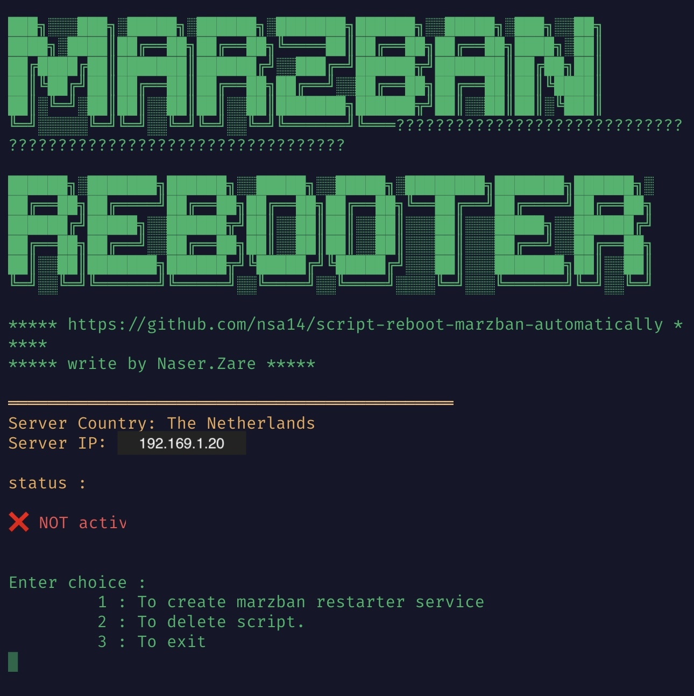

# welcome
 
<div dir="rtl">
<h2>
	اسکریپت ری استارت کردن پنل مرزبان بصورت اتوماتیک
</h2>

 کد اجرای دستور در کامند لینوکس :
</div>

   ```
    bash <(curl -fsSL https://raw.githubusercontent.com/nsa14/script-reboot-marzban-automatically/master/install.sh)
   ```
   <br>
   <br>
   
<hr>

<div dir="rtl">
* سیستم عامل پیشنهادی : ubuntu 22
  * فقط حتما سرور درسترسی  روت(root) داشته باشد

<hr>
 * حتما درابتدا سرور خود را با دستور زیر آپدیت و اپگرید و در انتها آنرا ریبوت نمایید و بعدا اقدام به اجرای اسکریپت نمایید

   ```sh
      apt update && apt upgrade -y
      sudo reboot
   ```


### روش اجرا :
>1 -  اسکریپت شامل 4 مرحله می باشد که همه مراحل آن بصورت خودکار تنظیمات را انجام میدهد.

>2 -  در مرحله 3 شما باید زمان ریبوت شدن مرزبان را بر حسب ساعت وارد نمایید مثلا: 1
ک نشاندهنده دهنده ریبوت شدن مرزبان  در هر 1 ساعت می باشد

>4 -  اجرای مرحله 4 و نمایش پیغام FINISH
> 
عملیات به درستی تنظیم و ذخیره شده است و در زمان انتخابی شما بصورت اتوماتیک اقدام به ریستارت کردن پنل مرزبان مینماید.
/پایان عملیات


</div>